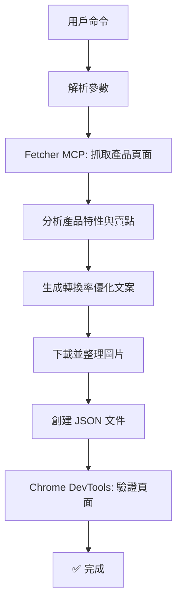

# Quick Reference: Add Product with AI Agent

## 命令格式 (Command Format)

```bash
Add product from [產品URL], SKU: [產品代碼], price $[現價] (original $[原價]), [促銷活動]
```

## 示例 (Examples)

### 基礎命令
```
Add product from https://example.com/wireless-charger, SKU: wireless-10w, price $29 (original $59), flash sale
```

### 自動生成 SKU
```
Add product from https://example.com/magnetic-battery, price $49 (original $99), BOGO deal
```

### 指定貨幣
```
Add product from https://example.com/power-bank, SKU: pb-20k, price €39 (original €79), limited-time offer
```

## 參數說明 (Parameters)

| 參數 | 必填 | 說明 | 示例 |
|------|------|------|------|
| URL | ✅ 是 | 產品頁面網址 | `https://example.com/product` |
| SKU | ❌ 否 | 產品唯一代碼（可自動生成） | `mag-charger-10w` |
| price | ✅ 是 | 當前售價 | `$49`, `€39`, `£29` |
| original | ❌ 否 | 原價（用於顯示折扣） | `$99`, `€79` |
| 促銷活動 | ❌ 否 | 銷售活動類型 | `flash sale`, `BOGO`, `limited drop` |

## 促銷活動類型 (Sale Event Types)

- **Flash Sale** - 限時快閃特賣
- **BOGO** - Buy One Get One（買一送一）
- **Limited Drop** - 限量發售
- **Emergency Drop** - 緊急降價
- **Bundle Deal** - 組合優惠
- **Clearance** - 清倉特賣

## AI Agent 執行流程 (Workflow)



## 自動生成的內容 (Auto-Generated Content)

### 文案框架 (Copywriting Frameworks)
- **4U Framework**: Useful, Urgent, Unique, Ultra-specific
- **PAS Framework**: Problem, Agitate, Solve
- **AIDA Framework**: Attention, Interest, Desire, Action

### 生成的區塊 (Generated Sections)
1. **Top Bar** - 頂部橫幅（促銷資訊 + 倒計時）
2. **Hero Section** - 主視覺區（標題 + 描述 + CTA）
3. **Detail HTML** - 詳細說明（問題 → 解決方案 → 證明）
4. **Reviews** - 用戶評論（6-12 則真實感評論）
5. **FAQ** - 常見問題（6-10 個問題解答）
6. **Purchase Section** - 購買區（價格 + 規格 + CTA）
7. **Sticky Footer** - 黏性底部（庫存警告 + CTA）
8. **Guarantee** - 保證承諾（退款 + 保固 + 運送）

## 驗證檢查清單 (Verification Checklist)

運行後自動檢查：
- [ ] 頁面無 JavaScript 錯誤
- [ ] 所有圖片正確載入
- [ ] 倒計時計時器運作
- [ ] 庫存計數器顯示
- [ ] CTA 按鈕功能正常
- [ ] 價格佔位符已替換 `{{price}}`
- [ ] 庫存佔位符已替換 `{stock}`
- [ ] 響應式佈局正常
- [ ] 圖示正確渲染
- [ ] FAQ 折疊功能運作

## 手動調整 (Manual Adjustments)

生成後可手動編輯：

### 修改價格或促銷
編輯 `src/data/products/{sku}/product_data.json`:
```json
{
  "price": {
    "currency": "USD",
    "current": 49,
    "original": 99
  }
}
```

### 調整倒計時
編輯 `src/data/products/{sku}/product_info.json`:
```json
{
  "countdown": {
    "durationSeconds": 900  // 15分鐘
  }
}
```

### 修改庫存範圍
編輯 `src/data/products/{sku}/product_info.json`:
```json
{
  "inventory": {
    "start": 100,    // 起始庫存
    "minimum": 15    // 最低庫存
  }
}
```

### 自訂標題文案
編輯 `src/data/products/{sku}/product_info.json`:
```json
{
  "hero": {
    "headline": "Your custom headline here",
    "description": "Your custom description..."
  }
}
```

## 故障排除 (Troubleshooting)

### 圖片未載入
```bash
# 檢查圖片路徑
ls public/products/{sku}/images/

# 確認 JSON 中的路徑
cat src/data/products/{sku}/product_data.json | grep "url"
```

### 頁面無法渲染
```bash
# 驗證 JSON 語法
npm run check

# 檢查控制台錯誤
npm run dev
# 訪問 http://localhost:4321/products/{sku}
```

### 佔位符未替換
檢查 `product_info.json`:
- 確認 `purchase.ctaLabel` 包含 `{{price}}`
- 確認 `stickyFooter.stockMessage` 包含 `{stock}`

## 進階選項 (Advanced Options)

### 自訂組件變體
創建 `src/data/products/{sku}/component-presets.json`:
```json
{
  "hero": "HeroSection/Minimal",
  "comments": "Comments/Carousel",
  "faq": "FAQ/TwoColumn"
}
```

### 批量添加產品
使用循環命令：
```bash
# 示例：從列表添加多個產品
for url in $(cat product-urls.txt); do
  # 命令：Add product from $url, ...
done
```

## 相關文檔 (Related Documentation)

- **完整工作流程**: [docs/agent-workflow-add-product.md](agent-workflow-add-product.md)
- **文案撰寫指南**: [docs/guidelines.md](guidelines.md)
- **工程標準**: [AGENTS.md](../AGENTS.md)
- **項目說明**: [CLAUDE.md](../CLAUDE.md)

## 支援的 MCP 工具 (MCP Tools)

確保已配置以下 MCP 伺服器：
- ✅ `mcp_servers.fetcher` - 抓取網頁內容
- ✅ `mcp_servers.chrome-devtools` - 瀏覽器驗證
- ⭕ `Context7` (可選) - 查詢最新文檔

## 常見問題 (FAQ)

**Q: SKU 可以使用中文嗎？**
A: 不建議。SKU 會用於 URL 路徑，建議使用英文字母、數字和連字符。

**Q: 如何修改生成的文案語氣？**
A: 編輯 `product_info.json` 中的對應字段。所有文案都可以手動調整。

**Q: 可以添加自訂 HTML 區塊嗎？**
A: 可以。在 `product_info.json` 的 `detailHtml` 字段中添加 HTML，使用 Tailwind 樣式。

**Q: 圖片必須從原網站下載嗎？**
A: 是的。為了頁面性能和穩定性，所有圖片應存儲在 `public/products/{sku}/images/`。

**Q: 支援多語言產品頁面嗎？**
A: 目前框架支援 i18n，但產品內容需要手動翻譯。AI agent 預設生成英文文案。

---

**快速啟動**:
```bash
# 1. 確保開發伺服器運行
npm run dev

# 2. 使用命令添加產品
# 例: Add product from https://example.com/product, SKU: my-product, price $49 (original $99), flash sale

# 3. 訪問生成的頁面
# http://localhost:4321/products/my-product

# 4. 如需調整，編輯 JSON 文件並刷新
```

**版本**: 1.0
**更新日期**: 2025-11-13
